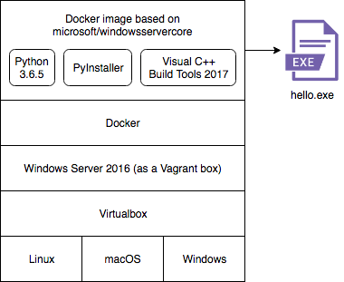

# Build .exe from Python script with a Docker container

These are the steps that allowed me to freeze a simple Python script to a Windows executable.

([edit this graphic on draw.io](https://www.draw.io/?lightbox=1&highlight=0000ff&edit=_blank&layers=1&nav=1&title=windows%2Bpyinstaller%20on%20docker%20#R1Vhbb9owFP41SNsDKBfC5bFpSzep0yoxrdujSUzizfFBjrnt1%2B84sQNJKKUSjBUVZH8%2Bto%2B%2Fc%2FGpO%2F5ttnmQZJF%2BgZjyjufEm45%2F1%2FG8ceDgrwa2JRCMRyWQSBaXkLsDpuwPNaCZlyxZTPOaoALgii3qYARC0EjVMCIlrOtic%2BD1XRckoS1gGhHeRp9ZrNISHdljafwTZUlqd3YdMzIj0e9EwlKY%2FTqePy8%2B5XBG7FpGPk9JDOs9yL%2Fv%2BLcSQJWtbHNLuabW0lbOm7wwWuktqVCnTPDKCSvCl%2BboGYm%2BTo1yamsJKY5E9SSn44frlCk6XZBIj67RAxBLVcax52KzrYTRa0Wlops9yCj1QCGjSm5RxI4ODEHGgfyx6a935rBQumcJayFiHCCpVt6RgA3Dw2FO%2FBYnz0zE2qeuzUp1vCuw0m%2Bx0vEGHDcIY7bCZqKbj0wsNxbHFfeGrk7e8HrcDU7h7juTakn4DN4Lgf02gZXMuRkcnsJgFabOlEo8FzY8x0XynQ9EowS%2F30kiCVKAqRo2H98H094BV70Y0%2BMW03cQ%2FdZk%2Fmek%2FEv3O5j9GnzQGEsI0wWpUkhAEH6%2FQ8M6Y3vs5IpIdaPrFgQECGqxCdMqFeJUxFYi4iTPWVSCRkQv84sqtTXFFFkqQGinyCPAwsihDeT2R7Uudn7qTi84ZqgcljJqlGmoYkKNmGVE03DUnJJyotiqXmkdMo6Z%2BgSsiFfjBn2v7gfuKKgvUSplZjVMXKlxktXtMY9Z%2FU1RwMmM8ifImWIgtCGRZIwsP9RRwLD8fGwIZCyOC9chnCUHZ9yYgUry%2FJHm%2BidGmuueIdTckwoNm5MclulSXhfeOVrBc5C2F3J6a42MRRJymKObTNbl1ZEX90YEkp54MyCjqm7jlqXOYJBx0yDDtkH8Awbpn8Me7QvhaYtJBXl2%2FN6gFxwJCff1kLgEXaNmhui36AouxJbXThlP288CkznnR%2B%2FQK1Hl9l%2FnahhciCu3xdXBsjjHqhjFcL2w%2BHOs1Ew2o%2FvVmA%2BXjOs08Q2A52V9OHxzEXglW6HXvmor17mUsdovBQfoTXES9Ojm1PSZp2Shm2UWrzHYvOCULl9evChnoBRk9ooNq1eYW%2BAgi73sO4wfFpvd5Ivy4Uhf28R25myjLRwafe5SpfSL042myZtEsej3WARijrcFlb0Id8TzEYX%2FWEw0jh41mTNOu3grUJGjal1BMpp3V8C7QRfNOwlczXnf67reqLcQyYV8xW%2FmwMCxmXrPWwbjtrNY7A3Ogt3di1VZZ%2B1eBf37vw%3D%3D))

## Making an .exe file from a script

These steps will guide you towards your very own .exe file.

### Prerequisites

You must be able to run Windows containers for Docker.

One way to achieve this is with the excellent [StefanScherer/windows-docker-machine](https://github.com/StefanScherer/windows-docker-machine) repository.

This works for Windows, macOS and GNU/Linux, because Vagrant runs on all three.

The `2016-box` will suffice.

### Building the Docker image

1. `git clone https://github.com/tssmits/docker-python-exe`
2. `cd docker-python-exe`
3. `docker build -t buildtools2017:latest -m 2G .`

### Run Docker container

4. `docker run -v C:$(pwd):C:/exampledir buildtools2017 -it`

### Preparation for building the .exe

Now that you're in the running Docker container, please surf to the example script.

5. `cd exampledir`

Please initiate a virtualenv.

6. `python -m venv venv`

Activate it.

7. `.\venv\Scripts\activate`

Now you can install the required packages.

8. `pip install pyinstaller`

### Building the .exe

Just one more command and your .exe is ready!

9. `pyinstaller --onefile hello.py`

### Running the resulting exe

You can now run the .exe file.

`.\dist\hello.exe`

## Known issues

### PyInstaller gives me: "WARNING: lib not found: api-ms-win-crt-math-l1-1-0.dll dependency"

You can ignore these warnings. The .exe will still run. Read more about this issue at [https://github.com/pyinstaller/pyinstaller/issues/1566](https://github.com/pyinstaller/pyinstaller/issues/1566).
